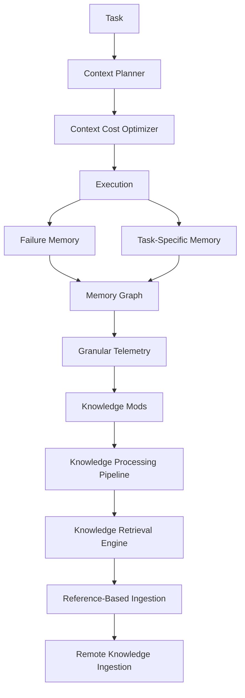

# codex_context_engine

An external memory and context orchestration engine for Codex.

The `codex_context_engine` is an external memory and context orchestration layer designed to help Codex work on complex projects without repeatedly rediscovering the same information.

Instead of reconstructing context from scratch on every task, the engine progressively builds, optimizes and connects contextual knowledge across executions.

The result is a system that becomes **more efficient, more aware of project structure, and less prone to repeating mistakes over time.**

---

# Canonical Runtime

`codex_context_engine` is the canonical runtime.

Operational entrypoints now live in this repository:

- `python3 scripts/boot.py --repo <path>`
- `python3 scripts/packet.py --task "..."`
- `python3 scripts/query.py <term>`
- `python3 scripts/global_metrics.py --refresh`

In cross-project mode, task packets now write telemetry both to the shared root `.context_metrics/` layer and to `.context_metrics/projects/<repo>/`, so savings reports can be attributed per repository.

---

# Core Idea

Large coding tasks often fail not because of model capability, but because of **context loss**.

Each run typically starts with limited awareness of:

- project structure
- previous decisions
- past failures
- task-specific knowledge

This leads to repeated exploration, unnecessary context loading, and duplicated reasoning.

`codex_context_engine` addresses this by introducing an **autoincremental context layer** that persists and evolves contextual knowledge across runs.

Instead of starting from zero, the engine gradually accumulates understanding of the project.

---

# How the Engine Works

The engine follows a layered contextual workflow.

Task  
↓  
Context Planner  
↓  
Context Cost Optimizer  
↓  
Execution  
↓  
Failure Memory  
↓  
Task-Specific Memory  
↓  
Memory Graph  
↓  
Granular Telemetry  
↓  
Knowledge Mods  
↓  
Knowledge Processing Pipeline  
↓  
Knowledge Retrieval Engine  
↓  
Reference-Based Ingestion  
↓  
Remote Knowledge Ingestion

Each layer improves how context is selected, used and remembered.

---

# Engine Architecture



---

# Context Planner

Determines **which contextual resources should be loaded** for a given task.

Responsibilities:

- detect task type
- select relevant context sources
- control context depth
- avoid unnecessary exploration

Goal: load the *right* context before execution begins.

---

# Context Cost Optimizer

Reduces token usage and latency by filtering context before it reaches the model.

Responsibilities:

- deduplicate context blocks
- score contextual relevance
- filter oversized or low-value entries
- prioritize useful context

Goal: ensure only high-value context is sent to the model.

---

# Failure Memory

Captures knowledge about **what did not work**.

Responsibilities:

- record failed attempts
- detect recurring friction points
- surface relevant failure patterns

Goal: prevent the engine from repeating ineffective strategies.

---

# Task-Specific Memory

Stores contextual knowledge associated with specific types of tasks.

Responsibilities:

- classify tasks into contextual domains
- persist task-related insights
- retrieve domain-relevant context

Goal: improve contextual precision for repeated workflows.

---

# Memory Graph

Transforms contextual memory into a **connected knowledge structure**.

Responsibilities:

- link tasks, files and decisions
- map contextual relationships
- enable graph-based context discovery

Goal: move from isolated memory records to connected contextual knowledge.

---

# Granular Telemetry

Extends telemetry from whole-task estimates into **task-plus-phase observability**.

Responsibilities:

- preserve backward-compatible task-level savings logs
- support optional phase/subtask instrumentation
- identify expensive task segments such as repo scan, test loops, or follow-up prompts
- expose granular coverage and hot spots in summaries

Goal: explain where context and token cost concentrate inside a task, not only across tasks.

---

# Knowledge Mods (Iteration 11)

Iteration 11 introduces **generic knowledge modules ("mods")** and a local learning workspace.

The engine can now create **domain-specific knowledge areas on demand**, allowing Codex to learn structured information about topics relevant to the project.

Example commands:

```text
learn ux
aprende ux
study accessibility
learn architecture
```

When a mod is requested for the first time, the engine automatically creates a local workspace:

```text
.codex_library/mods/<mod_id>/
```

This enables Codex to accumulate **domain knowledge across executions**, not just project memory.

---

# Knowledge Processing Pipeline (Iteration 12)

Iteration 12 adds a **document processing pipeline** that converts raw documents into reusable contextual artifacts.

Documents placed in a mod inbox are processed into compact artifacts such as:

```text
notes/
summaries/
indices/
manifests/
```

Typical pipeline stages:

```text
detect documents
→ extract text
→ normalize
→ semantic split
→ topic extraction
→ note generation
→ summary generation
→ index generation
→ manifest update
```

The goal is to avoid loading large source documents repeatedly and instead reuse **small structured artifacts**.

---

# Knowledge Retrieval Engine (Iteration 13)

Iteration 13 introduces a **retrieval layer** that selects the most relevant artifacts for a given request.

Instead of re-reading entire documents, the engine:

1. detects relevant knowledge mods
2. identifies likely topics
3. consults lightweight indices
4. loads a minimal set of notes or summaries

Example retrieval flow:

```text
request
→ detect mod
→ detect topic
→ consult index
→ load minimal artifact set
→ assemble context
```

This ensures that Codex receives **high-value contextual knowledge with minimal token cost**.

---

# Reference-Based Ingestion (Iteration 14)

Iteration 14 adds support for **learning from referenced local files** instead of requiring every source file to be copied manually into a mod inbox.

A mod can define:

```text
.codex_library/mods/<mod_id>/inbox/references.md
```

The engine uses that file as a reference manifest, resolves supported local paths, and processes the referenced files through the existing knowledge pipeline.

This iteration is designed for cases where the source material already exists in the repository or elsewhere on disk and should remain in place.

## Iteration 14 capabilities

- parse `inbox/references.md` inside a mod
- resolve referenced local files safely
- track referenced files in mod state
- store both content hash and `mtime` for change detection
- reprocess only when a referenced file changes
- support structured and code-adjacent file types through references

## Supported reference-oriented formats

- `.sql`
- `.xml`
- `.json`
- `.yaml`
- `.yml`
- `.py`
- `.csv`

## Iteration 14 state expectations

Evidence of Iteration 14 typically includes:

- `.codex_library/REFERENCES_TEMPLATE.md`
- one or more `inbox/references.md` files
- `manifests/state.json` containing `referenced_files`
- processing logic that uses both hash and `mtime`

---

# Remote Knowledge Ingestion (Iteration 15)

Iteration 15 adds a **remote acquisition layer** to the engine.

The goal is not to make the engine depend on live web access during retrieval.
Instead, the engine can now ingest documentation from URLs, convert the fetched content into local reproducible artifacts, and then feed those artifacts into the existing local knowledge pipeline.

This follows the principle:

> **remote acquisition, local reasoning**

## Iteration 15 capabilities

- register URL-based sources under a mod
- fetch registered remote sources
- store raw payloads locally
- create snapshot metadata records per fetch
- extract normalized text from supported remote formats
- emit canonical inbox documents for the existing learning flow
- preserve traceability from local artifact back to source URL

## Example commands

```bash
codex-context mod add-source android_core --url https://developer.android.com/guide --tag android --tag official-docs
codex-context mod fetch-sources android_core
codex-context mod learn android_core
```

## Supported remote formats

- HTML
- PDF
- Markdown
- TXT

## Remote ingestion design rules

- remote sources are used only during ingestion
- retrieval remains local-first
- snapshots should be reproducible
- raw, extracted, and inbox artifacts should remain traceable
- this iteration is not an open-ended crawler

---

# Example

Without the engine:

Task → Codex explores the repository → builds context → executes

With `codex_context_engine`:

Task  
↓  
Planner loads relevant context  
↓  
Optimizer filters context  
↓  
Codex executes with focused context  
↓  
Failure memory records outcome  
↓  
Memory graph connects new knowledge  
↓  
Telemetry explains cost distribution  
↓  
Knowledge mods store domain knowledge  
↓  
Retrieval engine loads only relevant artifacts  
↓  
Reference-based ingestion expands local learning sources  
↓  
Remote ingestion converts URLs into local knowledge

---

# Key Characteristics

## Autoincremental

The engine continuously accumulates contextual understanding across tasks.

Each execution improves future executions.

---

## Context-first execution

Instead of immediately running a task, the engine first determines:

- what context exists
- what context is relevant
- what context should be ignored

---

## External memory

Contextual knowledge is stored outside the model, allowing:

- persistent project awareness
- cross-task learning
- reproducible contextual state

---

## Failure-aware learning

The engine records mistakes and avoids repeating them.

This reduces exploration cost and accelerates problem solving.

---

## Knowledge-aware execution

The engine can now also accumulate **domain knowledge**, not just project context.

This allows Codex to reuse learned knowledge across tasks and projects.

---

## Local-first retrieval

Even when knowledge comes from references or URLs, retrieval still operates on local artifacts.

This preserves determinism, reduces dependency on live systems, and keeps context assembly reproducible.

---

# Local Knowledge Library

The knowledge system uses a local workspace:

```text
.codex_library/
```

Typical structure:

```text
.codex_library/
  registry.json                      # global mod registry
  REFERENCES_TEMPLATE.md             # template for reference-based ingestion
  mods/
    <mod_id>/
      mod.json                       # mod metadata and configuration
      inbox/                         # canonical local documents waiting to be processed
      inbox/references.md            # optional reference manifest for Iteration 14
      sources/                       # local source staging area used by prior learning flows
      processed/                     # processed intermediate artifacts
      notes/                         # compact note artifacts for retrieval
      summaries/                     # higher-level summaries for retrieval
      indices/                       # topic/index lookup artifacts
      manifests/                     # mod state, manifests, and processing metadata
      remote_sources/                # Iteration 15 remote acquisition workspace
      remote_sources/manifest.json   # registered remote URL sources
      remote_sources/raw/            # raw fetched payloads
      remote_sources/snapshots/      # per-fetch metadata manifests
      remote_sources/extracted/      # normalized extracted text from remote sources
```

## Folder and file purposes

- `registry.json` — tracks available mods in the local knowledge library
- `REFERENCES_TEMPLATE.md` — provides the standard template for `references.md`
- `mod.json` — stores per-mod metadata, identity, and settings
- `inbox/` — receives canonical local documents to be processed by the learning pipeline
- `inbox/references.md` — lists referenced local files that should be learned without copying them manually
- `sources/` — keeps source-stage material used by existing local ingestion flows
- `processed/` — stores intermediate processing outputs
- `notes/` — stores compact reusable notes selected by retrieval
- `summaries/` — stores condensed thematic summaries
- `indices/` — stores lightweight lookup structures for topic-aware retrieval
- `manifests/` — stores state, manifests, hashes, timestamps, and processing metadata
- `remote_sources/manifest.json` — registers remote documentation sources for the mod
- `remote_sources/raw/` — stores original fetched remote payloads
- `remote_sources/snapshots/` — stores fetch-time metadata for reproducibility and traceability
- `remote_sources/extracted/` — stores normalized text extracted from remote sources before inbox materialization

## Reference-based ingestion examples

Referenced files do not need to be copied into `inbox/` manually.
Instead, the mod can declare them in:

```text
.codex_library/mods/<mod_id>/inbox/references.md
```

This is especially useful for project-native assets such as SQL, JSON, YAML, Python, XML, or CSV files that already exist in place.

## Remote ingestion examples

Remote documentation can now be learned through registered URLs, materialized locally, and then processed like any other canonical inbox document.

Example flow:

```bash
codex-context mod add-source android_core --url https://developer.android.com/guide --tag android --tag official-docs
codex-context mod fetch-sources android_core
codex-context mod learn android_core
```

---

# MCP Support

The knowledge system is designed to integrate with MCP servers when available:

- **filesystem MCP** — local document access
- **git MCP** — repository awareness
- **fetch MCP** — optional external enrichment or acquisition support
- **playwright MCP** — UI inspection for UX-related knowledge

All MCP integrations remain **optional**.

The engine continues to function fully in **local-only mode**.

---

# What This Is Not

This project is **not**:

- a prompt collection
- an AI agent framework
- a replacement for Codex

Instead, it is a **context orchestration layer** designed to help Codex maintain and evolve contextual understanding across tasks.

---

# Why This Exists

Large AI-assisted projects frequently suffer from:

- context fragmentation
- repeated discovery work
- token inefficiency
- lack of long-term memory

`codex_context_engine` is an experiment in **treating context as a first-class system**, not a temporary prompt artifact.

---

# Current Status

The engine currently implements:

- context planning
- context optimization
- persistent failure memory
- task-specific contextual memory
- graph-based contextual relationships
- granular task-plus-phase telemetry
- generic domain knowledge modules
- document ingestion and processing
- knowledge retrieval with minimal context loading
- reference-based local file ingestion
- remote documentation ingestion with local snapshot materialization

Together these components create a layered contextual architecture that progressively improves Codex performance on complex repositories.

---

# Auto-Initialize Across Your Projects Directory

If you want every Git repository under your projects directory to be integrated automatically, use the cross-project installer plus the macOS `launchd` agent in `scripts/`.

Default scan path:

- `~/Documents/projects` when that directory exists
- otherwise `~/projects`

Requirement:

- Ruby must be installed and available in `PATH`, because the repository scanner runs through `scripts/install_cross_project_for_all_repos.rb`

Manual one-shot integration:

```bash
ruby scripts/install_cross_project_for_all_repos.rb
```

Automatic background integration on macOS:

```bash
./scripts/install_launch_agent.sh
```

What this does:

- scans the default projects directory for Git repositories
- creates or updates `.codex_context_engine/state.json` in each repository
- creates `AGENTS.md` when missing
- appends or refreshes a managed `codex_context_engine` block inside an existing `AGENTS.md`
- re-runs automatically at login, every 5 minutes, and whenever the configured projects directory changes

Useful environment variables:

- `CODEX_PROJECTS_DIR` to target a directory other than the default detected projects directory
- `CODEX_ENGINE_REPO` to point to a shared engine repository in a different path
- `CODEX_LAUNCH_AGENT_LABEL` to override the default `launchd` label

To remove the background agent:

```bash
./scripts/uninstall_launch_agent.sh
```

---

# Philosophy

The engine follows a simple principle:

> Context should evolve with the project.

Instead of rebuilding understanding every time, the system gradually accumulates structural and experiential knowledge.

Over time this transforms Codex from a stateless assistant into a **context-aware development collaborator**.

---

# License

MIT